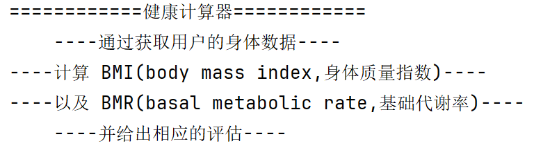
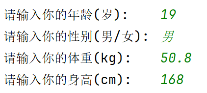
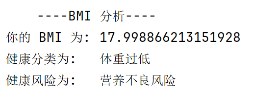
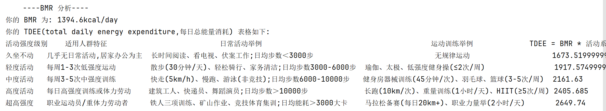

# Java 健康计算器 v1.0.0
仅涉及简单语法的控制台程序, 适合作为入门巩固练习、初步培养编程思维

***

## 下载
* 当时代码全写在 1 个类里面的, 200 行左右, 直接复制[源码](https://github.com/existed-name/Java-Health-Calculator/blob/main/HealthCalculatorV1.0.0/healthcalculatorv1/HealthCalculatorBeginnerVersion.java)即可( 代码框右上角*Copy raw file* )
* [更多下载方式](https://github.com/existed-name/Java-Health-Calculator?tab=readme-ov-file#%E4%B8%8B%E8%BD%BD%E8%AF%B4%E6%98%8E)

## 子文件说明
* healthcalculatorv1: 存放源码( 仅有 HealthCalculatorBeginnerVersion.java 一个文件 )
* images: 存放使用展示的图片
* readme: 项目说明

***

## 功能
1. 计算 BMI、BMR
2. 分析 BMI
3. 通过计算出的 BMR 给出 TDEE 表格

## 知识点
1. 入门语法
   - 变量声明与数据类型( `int`, `double`, `String` )
   - 基本运算
   - 条件分支( `if-else`, `switch-case` )
   - 控制台输入( `Scanner` )与输出( `System.out.println` )
   - 一维数组定义与遍历
   - 方法的简单定义与调用

2. 额外语法
   - 枚举类: 用 `枚举成员.ordinal()` 作为访问数组特定元素的下标, 语义更清晰
   - 线程休眠( `thread.sleep` )以及 `try-catch`: 用来实现短暂停顿,避免控制台输出过快

3. 面向过程编程  
   当时初学构造器, 心想以后全部要用面向对象写代码了, 干脆体验最后一把面向过程( 原来是 C 选手 ),   
   于是可以看到源码里面清一色的 `public static`( 当时对于权限修饰符也是一脸懵 )...  
   不过现在我在想: 除了用抽象类、接口, Java 可不可以像 C 一样把方法声明放 main 前面, 方法体放后面?

## 使用展示
1. 终端初始界面   
   

2. 输入信息   
   

3. 输出 BMI   
   

4. 输出 BMR 及 TDEE   
   
   
***
