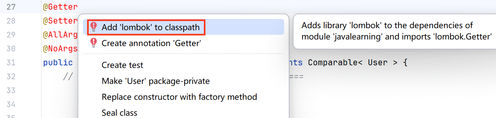

# lombok 框架说明
v3.0.0 引入了 `lombok` 框架, 这里讲解一下 `lombok` 的基本使用和注意事项

---

## 基本使用
在类的顶部添加特定注解, 用几行注解替代繁琐简单的方法( getter、setter、构造器等等 )
1. @Data: 提供无参构造器、getter、setter, 并重写 toString、hashCode、equals 方法; 可以拆分为以下注解
   1. @Getter: getter
   2. @Setter: setter
   3. @NoArgsConstructor: 无参构造器
   4. @ToString: 重写类的 toString 方法
   5. @EqualsAndHashCode: 重写 hashCode、equals 方法
2. @AllArgsConstructor: 全参构造器
   
---

## 导入框架
1. 在类顶部添加 `lombok` 注解, 等待编译器报错( 因为还没有添加依赖 )  
   

2. 选中报错的一行, 按 `Alt + Enter`, 弹出一个选择栏, 点击 `Add lombok to classpath`
   

3. 【记得联网】点击弹出的提示框的 `OK`
   
   
4. 成功添加 `lombok` 到 `External Libraries` 中
   

---

还可以参考[我的知乎博客](https://zhuanlan.zhihu.com/p/1929658439619027287)

---
